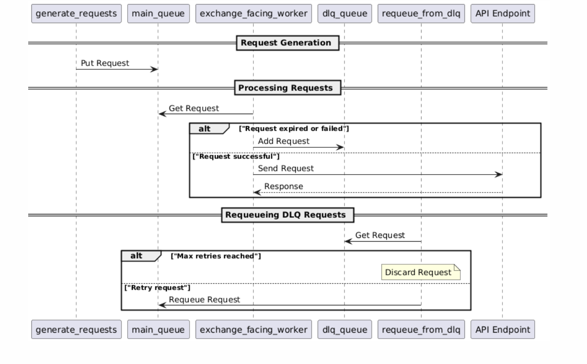

# Maximizing Client Throughput

## Table of Contents

1. **[Getting Started](#getting-started)**
2. **[Folder Structure](#folder-structure)**
3. **[Introduction](#introduction)**
4. **[Benchmarking System](#benchmarking-system)**
   - [Key Metrics Tracked](#key-metrics-tracked)
   - [How the Benchmarking System Works](#how-the-benchmarking-system-works)
5. **[Enhancing the Rate Limiter](#enhancing-the-rate-limiter)**
   - [Original Implementation](#original-implementation)
   - [Identified Issues](#identified-issues)
   - [Proposed Solution](#proposed-solution)
   - [Observation: Performance Improvement](#observation-performance-improvement)
   - [Potential Issue: 429 Errors Due to Latency](#potential-issue-429-errors-due-to-latency)
   - [Improved Version: Adaptive Buffering](#improved-version-adaptive-buffering)
6. **[Improving the Queue System](#improving-the-queue-system)**
   - [Issue](#issue)
   - [Solution: Queue Manager with Dead Letter Queue (DLQ)](#solution-queue-manager-with-dead-letter-queue-dlq)
   - [Lifecycle with Queue Manager](#lifecycle-with-queue-manager)
   - [Monitoring the Queue](#monitoring-the-queue)
7. **[Addressing Queue Bloating](#addressing-queue-bloating)**
8. **[Exploring Multithreading](#exploring-multithreading)**
   - [Rationale](#rationale)
   - [Changes to the Current Code](#changes-to-the-current-code)
9. **[Comparison Between Asyncio and Threading Client](#comparison-between-asyncio-and-threading-client)**
   - [Baseline Comparison](#baseline-comparison)
   - [Observation](#observation)
   - [Summary](#summary)
10. **[Overview and Modifications Summary](#overview-and-modifications-summary)**
    - [Modifying the Original Client](#modifying-the-original-client)
11. **[Final Thoughts](#final-thoughts)**


## Getting Started

```
pip install requirements.txt

# run the server
python3 original_server.py

# run async client
python3 async/client.py

# run multithreaded client
python3 thread/client.py

# run with profiling
mprof run python3 <MODEL>/client.py 

# visualise graph
mprof plot

```

## Folder Structure

- /async - folder for asyncio client
- /thread - folder for multi-threading client
- original_client.py - original version of the provided client
- original_server.py - original version of the provided server

## Introduction

This document provides a review and optimization of a client application aimed at maximizing throughput while adhering to server-imposed rate limits. The client interacts with a server using multiple API keys and is designed to send as many requests as possible without exceeding rate limits or causing request failures. It includes the issues identified in the existing implementation, the design choices made to address them, and the impact of these changes on performance. 

## Benchmarking System

> [!NOTE]
> Implementation of the benchmark class is inside `async/benchmark.py` and `thread/benchmark.py`

### Key Metrics Tracked

1. **Total Successful Requests**  
   - **Why:** Indicates system stability and efficiency under load.

2. **Total Failed Requests**  
   - **Why:** Identifies network or timeout issues to ensure retries and prevent bottlenecks.

3. **Average Latency (ms)**  
   - **Why:** Ensures fast response times and improves user experience.

4. **Throughput (TPS)**  
   - **Why:** Measures the system's capacity to handle high traffic without degradation.

---

### How the Benchmarking System Works

- **Recording Successful/Failed Requests:**  
  Logs successes with latencies and tracks failures to monitor stability.

- **Calculating Average Latency:**  
  Computes the mean latency of all successful requests to assess performance.

- **Calculating Throughput:**  
  Measures successful requests per second from the start of the benchmark.

- **Metrics Printing:**  
  Regularly prints key metrics for real-time feedback during execution.

## Enhancing the Rate Limiter

### Original Implementation

```python
class RateLimiter:
    def __init__(self, per_second_rate, min_duration_ms_between_requests):
        self.__per_second_rate = per_second_rate
        self.__min_duration_ms_between_requests = min_duration_ms_between_requests
        self.__last_request_time = 0
        self.__request_times = [0] * per_second_rate
        self.__curr_idx = 0

    @contextlib.asynccontextmanager
    async def acquire(self, timeout_ms=0):
        enter_ms = timestamp_ms()
        while True:
            now = timestamp_ms()
            if now - enter_ms > timeout_ms > 0:
                raise RateLimiterTimeout()

            # Fixed Interval Check
            if now - self.__last_request_time <= self.__min_duration_ms_between_requests:
                await asyncio.sleep(0.001)
                continue

            # Circular Buffer Check
            if now - self.__request_times[self.__curr_idx] <= 1000:
                await asyncio.sleep(0.001)
                continue

            break

        self.__last_request_time = self.__request_times[self.__curr_idx] = now
        self.__curr_idx = (self.__curr_idx + 1) % self.__per_second_rate
        yield self
```
---
### Identified Issues

The current rate limiter has two conditional statements that introduce brief sleeps to control the rate at which requests are sent:

1. **Fixed Interval Check:** Ensures that the time interval between consecutive requests does not fall below a predefined minimum (`min_duration_ms_between_requests`).

   ```python
   if now - self.__last_request_time <= self.__min_duration_ms_between_requests:
       await asyncio.sleep(0.001)
       continue
   ```

2. **Circular Buffer Check:** Ensures that no more than a specified number of requests are sent within any 1-second window.

   ```python
   if now - self.__request_times[self.__curr_idx] <= 1000:
       await asyncio.sleep(0.001)
       continue
   ```

**Redundancy in Checks:**

- Both checks aim to control request rates.

---

### Proposed Solution


We propose removing the **Fixed Interval Check**, allowing the **Circular Buffer Check** to regulate the request rate effectively. This change reduces unnecessary context switching and improves performance. The **Circular Buffer Check** handles both bursty and constant-rate traffic efficiently.

**Importance of Handling Both Traffic Types:**

- **Bursty Traffic:** Useful in scenarios like high-frequency trading, where multiple actions need to be performed quickly within a short time frame. For example, executing a series of buy/sell actions to capitalize on rapid price movements in a volatile market.

- **Constant-Rate Traffic:** Ideal for retrieving data at regular intervals to maintain accuracy and consistency. This applies to oracle services or pricing feeds, where information must be regularly updated to reflect real-time market conditions.

---

### Observation: Performance Improvement

**Benchmark Results**:  
After removing the **Fixed Interval Check**, throughput increased from **~74 TPS to ~85 TPS**.

#### **Reasoning**:
- The **Fixed Interval Check** introduces **context switching**. Each time this check fails, the coroutine **yields control** back to the event loop, resulting in **overhead** because:
  1. The **state** of the coroutine must be saved.
  2. The **event loop switches** to another coroutine.
  3. Later, the **original coroutine's state is restored** to continue execution.
  
- Removing this check reduces **context switching and scheduling delays**, improving the efficiency of coroutine execution.

- The **Circular Buffer Check** alone ensures requests are **properly spaced across a 1-second window**, allowing the client to handle both **burst and constant-rate traffic** without unnecessary pauses. This results in smoother, **more efficient request handling**. Additionally, the server side rate limiter also uses circular buffer to track the requests, adhering to the same rate limiting rules will be optimal.

---
### Potential Issue: 429 Errors Due to Latency

While removing the **Fixed Interval Check** improves throughput, it may still lead to **429 errors**. This is due to **timestamp discrepancies** between the **client** and **server** rate limiters, caused by **incoming latency differences** on the server-side.

#### **How the Issue Occurs:**
- The **client-side rate limiter** records the difference between the **current request** and the **20th previous request** as **1000 ms (1 second)**, passing the client-side check.
- However, due to **latency variations**, the **server** might calculate the time difference as **less than 1000 ms**, causing the request to **fail the servers rate limit** and result in a **429 Error**.

#### **Example Walkthrough:**

1. **1st Request:**
   - Sent at **0 ms** from the client.
   - **Server timestamp:** Received at **40 ms** (due to **40 ms latency**).  
   - **Recorded on the server's circular buffer:** 40 ms.

2. **20th Request:**
   - Sent at **1000 ms** on the client (passes the client's rate limit).  
   - **Server timestamp:** Received at **1036 ms** (with **36 ms latency**).  
   - **Recorded on the server's circular buffer:** 1036 ms.

3. **Circular Buffer Check on the Server:**
   - **Difference between the 1st and 20th request:**  
     **1036 ms - 40 ms = 996 ms**, which is **less than 1000 ms**.

Since the **server's calculation** shows the difference as **996 ms** instead of **1000 ms**, the **server rejects the request with a 429 Error**. To prevent **429 errors**, it's important to account for **latency variability** between requests. Adding a **latency buffer** (e.g., an extra 50-100 ms delay) on the client side can help ensure that **timestamp discrepancies** don't cause requests to fail the **server's rate limiter**.

---
### Improved Version: Adaptive Buffering

```python
class RateLimiter:
    def __init__(self, per_second_rate, min_duration_ms_between_requests):
        self.__per_second_rate = per_second_rate
        self.__min_duration_ms_between_requests = min_duration_ms_between_requests
        self.__request_times = [0] * per_second_rate
        self.__curr_idx = 0

        self.__latency_window = deque(maxlen=100)  # record of the last 100 latencies
        self.__buffer = 40  # initial buffer (ms)
        self.__min_buffer = 30  # min buffer (ms)
        self.__max_buffer = 50  # max buffer (ms)

    def update_buffer(self):
        # calculate a moving average of the recent latencies
        if len(self.__latency_window) > 0:
            avg_latency = sum(self.__latency_window) / len(self.__latency_window)
            # adjust buffer based on average latency
            self.__buffer = min(self.__max_buffer, max(self.__min_buffer, int(avg_latency * 1.1)))

    def record_latency(self, latency):
        self.__latency_window.append(latency)
        self.update_buffer()
    
    @contextlib.asynccontextmanager
    async def acquire(self, timeout_ms=0):
        enter_ms = timestamp_ms()
        buffer = self.__buffer
        initial_buffer = self.__min_duration_ms_between_requests * self.__per_second_rate
        
        while True:
            now = timestamp_ms()

            if now - enter_ms > timeout_ms > 0:
                raise RateLimiterTimeout()

            if now - self.__request_times[self.__curr_idx] <= initial_buffer + buffer:
                # sleep the exact remaining time to the next second
                sleep_time = (initial_buffer + buffer - (now - self.__request_times[self.__curr_idx])) / 1000
                await asyncio.sleep(sleep_time)
                continue
            
            break
        
        self.__request_times[self.__curr_idx] = now
        self.__curr_idx = (self.__curr_idx + 1) % self.__per_second_rate
        yield self
```
> [!NOTE]
> Implementation both inside `async` and `thread` folder as `rate_limiter.py`

#### Explanation of Adaptive Buffering

This enhanced version introduces **adaptive buffering**, which fine-tunes the buffer size based on real-time **latency trends**. This ensures the system stays compliant with the server's rate limits while minimizing unnecessary delays and maximizing throughput. 


#### Key Enhancements
1. **Latency Window for Adaptive Buffering:**  
   - A **deque** stores the last **100 latencies** to track trends in request delays.
   - The **buffer size** is updated dynamically using a **moving average** of recorded latencies.
   - The formula used is:  
     ```python
     buffer = min(self.__max_buffer, max(self.__min_buffer, int(avg_latency * 1.1)))
     ```
    - This ensures the buffer size adjusts proportionally to observed latency while staying within a **safe range** (30 ms to 50 ms based on server's `MAX_LATENCY_MS`).

2. **Dynamic Sleep Calculation:**  
   - If the time between requests violates the rate limit, the **exact remaining time** needed to comply is calculated:
     ```python
     sleep_time = (initial_buffer + buffer - (now - self.__request_times[self.__curr_idx])) / 1000
     ```
   - This approach avoids **excessive sleeping** and ensures the request rate is optimized.

#### Why Adaptive Buffering Matters

Even though the **maximum server-side latency** is known (e.g., `MAX_LATENCY_MS = 50 ms`), real-world latency often varies. **Hardcoding a fixed buffer** is suboptimal, as it can either:

- **Undershoot latency**: Leading to premature requests and **429 errors**.
- **Overshoot latency**: Reducing throughput by **waiting longer than necessary**.

With **adaptive buffering**, the system continuously **learns from recent trends** and dynamically adjusts the buffer to balance **performance and compliance**.

---

### Conclusion

1. **Remove** Fix Interval Checks and only **keeping** the Circular Buffer Checks
2. Account for the server's latency and dynamically adjusts it for additional buffer when sending requests, to prevent rate limiting errors (429). 


## Improving Queue System

### Current Implementation
```python
async def exchange_facing_worker(url: str, api_key: str, queue: Queue, logger: logging.Logger):
    rate_limiter = RateLimiter(PER_SEC_RATE, DURATION_MS_BETWEEN_REQUESTS)
    async with aiohttp.ClientSession() as session:
        while True:
            request: Request = await queue.get()
            remaining_ttl = REQUEST_TTL_MS - (timestamp_ms() - request.create_time)

            if remaining_ttl <= 0:
                logger.warning(f"Ignoring request {request.req_id} due to expired TTL.")
                continue
            try:
                async with rate_limiter.acquire(timeout_ms=remaining_ttl):
                    async with async_timeout.timeout(1.0):
                        nonce = timestamp_ms()
                        data = {'api_key': api_key, 'nonce': nonce, 'req_id': request.req_id}
                        async with session.request('GET', url, data=data) as resp:
                            json = await resp.json()
                            if json['status'] == 'OK':
                                logger.info(f"API response: status {resp.status}, resp {json}")
                            else:
                                logger.warning(f"API response: status {resp.status}, resp {json}")
            except RateLimiterTimeout:
                logger.warning(f"Ignoring request {request.req_id} due to TTL in rate limiter.")
```

---
### Issue

The current implementation allows **more requests to be generated** than the client can process. This leads to **expired TTLs** for unprocessed requests in the queue. When the `remaining_ttl` drops below 0 or when there is a **request timeout**, the request is **dropped**. While this prevents the queue from becoming clogged, it also results in **wasted resources** and **lost requests** that could have been retried.


---
### Solution: Queue Manager with Dead Letter Queue (DLQ)

To improve request management, we introduce a **Queue Manager** that utilizes:
1. **Main Queue:** Processes requests under normal operation.
2. **Dead Letter Queue (DLQ):** Stores failed or timed-out requests for **retry** or further processing. This helps ensure that no valid request is wasted, even if it initially fails or exceeds its TTL.  


> [!NOTE]
> See implementation at `async/queue_manager.py`


This strategy improves **resilience** by providing better queue state management. Requests are **re-prioritized** from the DLQ, minimizing dropped requests and ensuring all requests receive multiple attempts before being discarded. In the event that the request hits the max retry limit, we will store the `req_id` for manual processing and to prevent sending redundant request, as we can assume that these requests are invalid. 

#### How Do Retry Requests Get Prioritized Over New Requests?
- **Cooldown Window for New Requests:**  
   When new requests are generated, a **short cooldown period** is introduced between them. This window allows the **Queue Manager** to **re-slot retry requests** into the queue before more new requests are created.

- **Not a Strict Priority Queue:**  
   While this is not a strict **priority queue** (where retry requests are inserted at the front), the **Queue Manager** ensures that **retry requests are slotted into the queue as soon as possible**, taking advantage of gaps in new request generation. 

This design ensures that **retry requests** are **handled promptly** without requiring a complex priority queue, optimizing for both **simplicity** and **timeliness**.

---
### Lifecycle with Queue Manager


---
### Monitoring the Queue 

Using the below metrics we are able to get the current state of the DLQ and Main Queue to check if there is an existing bottleneck in processing the requests inside the queue, allowing us to check the risk of the requests inside the main queue timing out due to expired TTL. 

  - **Queue Monitoring**: Track main queue and DLQ sizes, processing rates, and retry statistics.

  - **Queue Sizes**: Monitor and log the sizes of the main queue and DLQ at regular intervals.

  - **Graveyard Metrics**: Monitor the number of requests that exceed the maximum retry limit and are moved to the graveyard.


```
--- Accumulated Benchmark Metrics ---
2024-10-20 16:40:49,644 - stats - INFO - Elapsed Time: 5.00 seconds
2024-10-20 16:40:49,644 - stats - INFO - Total Successful Requests: 414
2024-10-20 16:40:49,644 - stats - INFO - Total Failed Requests: 0
2024-10-20 16:40:49,644 - stats - INFO - Total Throughput: 82.78 req/sec
2024-10-20 16:40:49,644 - stats - INFO - Average Latency: 207.68 ms
2024-10-20 16:40:49,644 - stats - INFO - Queue Sizes - Main: 26, DLQ: 0, Graveyard: 0
2024-10-20 16:40:49,644 - stats - INFO - Average Queue Sizes - Main: 13.00, DLQ: 0.00
2024-10-20 16:40:54,645 - stats - INFO - 
--- Accumulated Benchmark Metrics ---
2024-10-20 16:40:54,645 - stats - INFO - Elapsed Time: 10.00 seconds
2024-10-20 16:40:54,645 - stats - INFO - Total Successful Requests: 834
2024-10-20 16:40:54,645 - stats - INFO - Total Failed Requests: 0
2024-10-20 16:40:54,645 - stats - INFO - Total Throughput: 83.38 req/sec
2024-10-20 16:40:54,645 - stats - INFO - Average Latency: 322.23 ms
2024-10-20 16:40:54,645 - stats - INFO - Queue Sizes - Main: 40, DLQ: 0, Graveyard: 0
2024-10-20 16:40:54,645 - stats - INFO - Average Queue Sizes - Main: 22.00, DLQ: 0.00
2024-10-20 16:40:59,646 - stats - INFO - 
--- Accumulated Benchmark Metrics ---
2024-10-20 16:40:59,646 - stats - INFO - Elapsed Time: 15.00 seconds
2024-10-20 16:40:59,646 - stats - INFO - Total Successful Requests: 1262
2024-10-20 16:40:59,646 - stats - INFO - Total Failed Requests: 0
2024-10-20 16:40:59,646 - stats - INFO - Total Throughput: 84.12 req/sec
2024-10-20 16:40:59,646 - stats - INFO - Average Latency: 430.42 ms
2024-10-20 16:40:59,646 - stats - INFO - Queue Sizes - Main: 97, DLQ: 0, Graveyard: 0 
2024-10-20 16:40:59,646 - stats - INFO - Average Queue Sizes - Main: 40.75, DLQ: 0.00
2024-10-20 16:41:04,647 - stats - INFO - 
```


---
### Addressing the Root Cause: Bloating of the Main Queue

- Currently, the **rate of generating requests exceeds the rate of dequeuing requests**, causing **queue bloating** and leading to **TTL expirations**. We are limited to only **5 API keys**, each associated with a worker consuming requests from the queue. This restriction results in a processing rate that is too slow to handle the incoming traffic effectively, causing requests to expire before being processed. 

- The situation is further exacerbated by **latencies on both the client and server sides** due to rate limiting constraints, which slow down the consumption of requests from the queue. While the **Dead Letter Queue (DLQ)** allows failed requests to be retried, **it does not address the root issue**: the imbalance between the rate of request generation and processing.

To mitigate this problem, we can consider several workarounds:

1. **Implementing Backpressure on `generate_requests()`:** By controlling the rate at which requests are generated based on the current state of the queue, we can prevent the system from being overwhelmed. This approach assumes that we are able to modify the `generate_requests()` function.
    ```python
      # Apply backpressure if the queue is full
    if queue.qsize() >= max_queue_size:
        print(f"Queue is full ({queue.qsize()}), pausing request generation.")
        await asyncio.sleep(0.5)  # Wait before checking again
        continue
    ```

2. **Implementing Multithreading:** By implementing multithreading, we are able to better manage the rate of consumption of the request, resolving the issue of the expired requests TTL. 


## Exploring Multithreading

### Rationale

To **manage request processing rate** and **reduce TTL expirations**, we introduced multithreading. Multiple workers accessing the same queue increase the rate at which requests are dequeued, preventing the main queue from overloading.
> **Note:** See the `thread` folder for implementation details.

### Changes to the Current Code

1. **Implement Multithreading Processes:**
   - **Request Generator:** Run `generate_requests()` in a separate thread (assuming modifications are allowed).
   - **Metrics Printing:** Move metrics logging to a dedicated thread.
   - **Exchange Facing Workers:** Run multiple threads for workers handling API requests.

2. **Implement Locking on Shared Resources:**
   - **Queue Manager:** Use locks when accessing shared data structures like the graveyard to ensure thread safety.
   - **Thread-Safe Rate Limiter:** Modify the rate limiter to be thread-safe if multiple threads share API keys.

> **Note:** We use timestamps for nonces, as the GIL (Global Interpreter Lock) ensures only one thread executes Python code at a time, minimizing the chance of generating the same timestamp. However, under high request volumes, there’s still a risk of **nonce collisions** if multiple requests fall within the same millisecond. To avoid future issues, consider combining timestamps with a **thread-local counter** or **UUID** for guaranteed uniqueness.

---

## Comparison Between Asyncio and Threading Client

Below is a comparison of our current implementations using asynchronous programming and multithreading.

### Baseline of Comparison

**Asyncio:**

1. 5 Coroutines (one for each API key).
2. 1 Coroutine to generate requests.
3. 1 Coroutine for the Queue Manager to requeue from the DLQ.
4. 2 Coroutines for monitoring and benchmarking.

**Multithreading:**

1. 5 Threads (one for each API key).
2. 1 Thread to generate requests.
3. 1 Thread for the Queue Manager to requeue from the DLQ.
4. 2 Threads for monitoring and benchmarking.

---

### Observation

**Asyncio Client (~84 TPS):**

- Achieves higher throughput due to efficient handling of concurrent I/O-bound operations.
- **Issue:** Requests accumulate in the queue, leading to **TTL expirations**.

```
ASYNCIO STATS
Elapsed Time: 25.01 seconds
Total Successful Requests: 2102
Total Failed Requests: 13
Total Throughput: 84.06 req/sec
Average Latency: 769.45 ms
Queue Sizes - Main: 136, DLQ: 0, Graveyard: 13
Average Queue Sizes - Main: 81.67, DLQ: 0.00
```

**Threading Client (~77 TPS):**

- Slightly lower throughput due to thread overhead.
- **Advantage:** Multiple threads dequeue requests simultaneously, keeping the queue size small and reducing TTL expirations.

```
THREADING STATS
Elapsed Time: 25.00 seconds
Total Successful Requests: 1939
Total Failed Requests: 0
Total Throughput: 77.48 req/sec
Average Latency: 75.12 ms
Queue Sizes - Main: 1, DLQ: 0, Graveyard: 0
Average Queue Sizes - Main: 1.00, DLQ: 0.00
```

**CPU Utilization**
> [!NOTE]
> See `img/cpu_benchmark_*.png` for utilization graph
- Asyncio client is slightly less CPU intensive than Thread client. 

---

### Possible Explanations

**CPU Utilization and GIL Impact:**  
- The **Global Interpreter Lock (GIL)** in Python limits the performance of multi-threaded programs by allowing only one thread to execute Python bytecode at a time, even on multi-core CPUs. This makes the **Threading client** more CPU-intensive since threads contend for the GIL. In contrast, **Asyncio** bypasses the GIL to some extent by focusing on I/O-bound tasks with a single event loop, resulting in slightly lower CPU usage.

**Throughput (TPS) and GIL Constraints:**  
- The **GIL** can restrict the **Threading client;s** throughput, contributing to its lower **77.48 TPS**, as only one thread can execute Python code at a time. However, because threading is more effective at handling blocking I/O, it maintains stable performance. **Asyncio**, despite achieving higher **84.06 TPS**, leverages non-blocking I/O and cooperative multitasking, allowing it to manage more requests without being restricted by the GIL.

**Graveyard and Queue Size Management:**  
- While **Asyncio** excels in throughput, the accumulation of **136 requests** in its queue indicates that the event loop struggles under heavy load, leading to **13 TTL expirations**. On the other hand, the **Threading client** avoids queue buildup, keeping it at **1 request**, with no expirations, as multiple threads can process requests independently. However, the effectiveness of threading is limited by the GIL, which can reduce its scalability for CPU-bound workloads.


## Overview

### Modifying the Original Client for Improved Performance

To enhance throughput and optimize request management, we made the following modifications:

1. **Removed Redundant Waits:**
   - Eliminated the Fixed Interval Check in the rate limiter to reduce unnecessary pauses and context switching.
   - Relied on the Circular Buffer Check for rate limiting, improving throughput.

2. **Introduced a Queue Manager:**
   - Added a Queue Manager to handle the Main Queue and DLQ.
   - Implemented Graveyard Tracking for requests exceeding the maximum retry count.
   - Prioritized DLQ requests over new ones to ensure time-sensitive retries are processed promptly.

---
### Final Thoughts

Currently, the **threading client** offers **greater reliability** by ensuring **guaranteed request delivery** at the expense of **throughput** (~77 TPS). Its **preemptive multitasking** model ensures that **requests are processed without delay**, even when individual threads are blocked on I/O. This makes threading the better option when **consistent, on-time delivery** is critical, as it avoids **TTL expirations** through **concurrent dequeuing** and **independent thread execution**.

However, **threading incurs additional overhead** from **context switching** and **synchronization mechanisms**, leading to **higher memory usage**. This can limit performance under heavy loads, especially in **high-frequency I/O-bound tasks** where **asyncio** excels. Asyncio's **non-blocking, single-threaded event loop** minimizes these costs and achieves higher throughput (~84 TPS) by avoiding **thread management overhead**. 

With **adaptive rate control** to regulate request generation, the **asyncio client** can effectively prevent **TTL expirations**, making it the **superior long-term solution**. Its ability to **scale efficiently** under high concurrency, while consuming **less memory**, ensures that it will outperform threading as workloads grow.

In summary, **threading currently provides guaranteed reliability**, but with proper request regulation, **asyncio becomes the optimal solution** due to its **speed, efficiency, and scalability**.