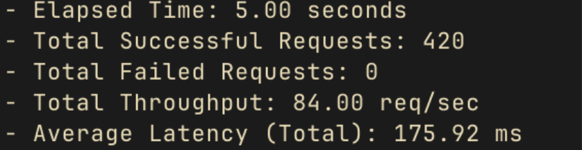
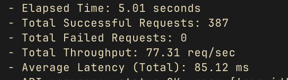

# Maximizing Client Throughput

## Introduction

This document presents a review and modification of the client code to maximize throughput while adhering to server-imposed rate limits. It outlines the issues identified in the existing implementation, the design choices made to address them, and the impact of these changes on performance. The focus is on refining the **rate limiter** and improving **queue management** to handle both bursty and constant-rate traffic efficiently.


## Benchmarking the Client

### Methodology

Benchmarking is essential to measure the performance improvements accurately. The process involves:

1. **Setup:**
   - **API Keys:** Use **5 API keys**, each associated with a worker task sending requests concurrently.
   - **Rate Limiter:** Implement a rate limiter to control request rates per API key.
   - **Metrics Collection:** Record key performance metrics:
     - Total successful requests
     - Total failed requests
     - Average latency per request
     - Throughput (requests per second, TPS)

2. **Execution:**
   - **Request Generation:** Continuously generate requests and add them to a queue.
   - **Request Processing:** Worker tasks fetch requests from the queue, pass them through the rate limiter, and send them to the server.
   - **Metrics Tracking:** Use a benchmarking class to monitor request timings, success rates, and latencies.
   - **Real-Time Feedback:** Log and print metrics every 5 seconds for monitoring.


## Enhancing the Rate Limiter

### Original Implementation

```python
class RateLimiter:
    def __init__(self, per_second_rate, min_duration_ms_between_requests):
        self.__per_second_rate = per_second_rate
        self.__min_duration_ms_between_requests = min_duration_ms_between_requests
        self.__last_request_time = 0
        self.__request_times = [0] * per_second_rate
        self.__curr_idx = 0

    @contextlib.asynccontextmanager
    async def acquire(self, timeout_ms=0):
        enter_ms = timestamp_ms()
        while True:
            now = timestamp_ms()
            if now - enter_ms > timeout_ms > 0:
                raise RateLimiterTimeout()

            # Fixed Interval Check
            if now - self.__last_request_time <= self.__min_duration_ms_between_requests:
                await asyncio.sleep(0.001)
                continue

            # Circular Buffer Check
            if now - self.__request_times[self.__curr_idx] <= 1000:
                await asyncio.sleep(0.001)
                continue

            break

        self.__last_request_time = self.__request_times[self.__curr_idx] = now
        self.__curr_idx = (self.__curr_idx + 1) % self.__per_second_rate
        yield self
```
---
### Identified Issues

Currently, the rate limiter has **two conditional statements** that trigger a brief **sleep** with the goal of controlling the rate at which requests are sent:

1. **Fixed Interval Check**:  
   Ensures that the time interval between consecutive requests does not fall below a predefined minimum (`min_duration_ms_between_requests`).
   ```python
   if now - self.__last_request_time <= self.__min_duration_ms_between_requests:
       await asyncio.sleep(0.001)
       continue
   ```

2. **Circular Buffer Check**:  
   Ensures that the time difference between the current request and the request that was sent 20 positions earlier is **at least 1 second**.
   ```python
   if now - self.__request_times[self.__curr_idx] <= 1000:
       await asyncio.sleep(0.001)
       continue
   ```

**Redundancy in Checks:**
  - **Fixed Interval Check:** Enforces a minimum time between consecutive requests.
  - **Circular Buffer Check:** Ensures no more than a specified number of requests are sent within any 1-second window.
  - **Overlap:** Both checks aim to control request rates but the **Circular Buffer Check** alone suffices for rate limiting.

---

### Proposed Solution

**Remove the Fixed Interval Check**, allowing the **Circular Buffer Check** to regulate the request rate effectively, the **Fixed Interval Check** is redundant and adds unnecessary **context switching**. The **Circular Buffer Check** allows for more **adaptive rate limiting**, handling both **burst** and **constant-rate traffic** more efficiently. Example of why being able to handle both kinds of traffic can matter: 


- **Bursty Traffic:**  
  - Useful for scenarios like **high-frequency trading**, where multiple actions need to be performed quickly in a **short time frame** (e.g., placing or canceling many orders within milliseconds).  
  - **Example:** Executing a series of buy/sell actions to take advantage of price movements in a volatile market.

- **Constant-Rate Traffic:**  
  - Ideal for **retrieving data at regular intervals** to maintain accuracy and consistency. This applies to **oracle services** or **pricing feeds**, where information (e.g., exchange rates or asset prices) must be regularly updated to reflect real-time market conditions.  
  - **Example:** A pricing oracle querying prices from external sources every few seconds to keep the platform's price feeds up to date and prevent discrepancies or stale data.

---

### Observation: Performance Improvement

**Benchmark Results**:  
After removing the **Fixed Interval Check**, throughput increased from **~74 TPS to ~85 TPS**.

#### **Reasoning**:
- The **Fixed Interval Check** introduces **context switching**. Each time this check fails, the coroutine **yields control** back to the event loop, resulting in **overhead** because:
  1. The **state** of the coroutine must be saved.
  2. The **event loop switches** to another coroutine.
  3. Later, the **original coroutine's state is restored** to continue execution.
  
- Removing this check reduces **context switching and scheduling delays**, improving the efficiency of coroutine execution.

- The **Circular Buffer Check** alone ensures requests are **properly spaced across a 1-second window**, allowing the client to handle both **burst and constant-rate traffic** without unnecessary pauses. This results in smoother, **more efficient request handling**.

---
### Potential Issue: 429 Errors Due to Latency

While removing the **Fixed Interval Check** improves throughput, it may still lead to **429 errors**. This is due to **timestamp discrepancies** between the **client** and **server** rate limiters, caused by **incoming latency differences** on the server-side.

#### **How the Issue Occurs:**
- The **client-side rate limiter** records the difference between the **current request** and the **20th previous request** as **1000 ms (1 second)**, passing the client-side check.
- However, due to **latency variations**, the **server** might calculate the time difference as **less than 1000 ms**, causing the request to **fail the servers rate limit** and result in a **429 Error**.

#### **Example Walkthrough:**

1. **1st Request:**
   - Sent at **0 ms** from the client.
   - **Server timestamp:** Received at **40 ms** (due to **40 ms latency**).  
   - **Recorded on the server's circular buffer:** 40 ms.

2. **20th Request:**
   - Sent at **1000 ms** on the client (passes the client's rate limit).  
   - **Server timestamp:** Received at **1036 ms** (with **36 ms latency**).  
   - **Recorded on the server's circular buffer:** 1036 ms.

3. **Circular Buffer Check on the Server:**
   - **Difference between the 1st and 20th request:**  
     **1036 ms - 40 ms = 996 ms**, which is **less than 1000 ms**.

Since the **server's calculation** shows the difference as **996 ms** instead of **1000 ms**, the **server rejects the request with a 429 Error**.

**Conclusion:**
To prevent **429 errors**, it's important to account for **latency variability** between requests. Adding a **latency buffer** (e.g., an extra 50-100 ms delay) on the client side can help ensure that **timestamp discrepancies** don't cause requests to fail the **server's rate limiter**.

---
### Improved Version: Adaptive Buffering

```python
class RateLimiter:
    def __init__(self, per_second_rate, min_duration_ms_between_requests):
        self.__per_second_rate = per_second_rate
        self.__min_duration_ms_between_requests = min_duration_ms_between_requests
        self.__request_times = [0] * per_second_rate
        self.__curr_idx = 0

        self.__latency_window = deque(maxlen=100)  # record of the last 100 latencies
        self.__buffer = 50  # initial buffer (ms)
        self.__min_buffer = 30  # min buffer (ms)
        self.__max_buffer = 150  # max buffer (ms)

    def update_buffer(self):
        # calculate a moving average of the recent latencies
        if len(self.__latency_window) > 0:
            avg_latency = sum(self.__latency_window) / len(self.__latency_window)
            # adjust buffer based on average latency
            self.__buffer = min(self.__max_buffer, max(self.__min_buffer, int(avg_latency * 1.1)))

    def record_latency(self, latency):
        self.__latency_window.append(latency)
        self.update_buffer()
    
    @contextlib.asynccontextmanager
    async def acquire(self, timeout_ms=0):
        enter_ms = timestamp_ms()
        buffer = self.__buffer
        initial_buffer = self.__min_duration_ms_between_requests * self.__per_second_rate
        
        while True:
            now = timestamp_ms()

            if now - enter_ms > timeout_ms > 0:
                raise RateLimiterTimeout()

            if now - self.__request_times[self.__curr_idx] <= initial_buffer + buffer:
                # sleep the exact remaining time to the next second
                sleep_time = (initial_buffer + buffer - (now - self.__request_times[self.__curr_idx])) / 1000
                await asyncio.sleep(sleep_time)
                continue
            
            break
        
        self.__request_times[self.__curr_idx] = now
        self.__curr_idx = (self.__curr_idx + 1) % self.__per_second_rate
        yield self
```
#### **Explanation of Adaptive Buffering**  

This enhanced version introduces **adaptive buffering**, which fine-tunes the buffer size based on real-time **latency trends**. This ensures the system stays compliant with the server's rate limits while minimizing unnecessary delays and maximizing throughput. 


#### **Key Enhancements**  
1. **Latency Window for Adaptive Buffering:**  
   - A **deque** stores the last **100 latencies** to track trends in request delays.
   - The **buffer size** is updated dynamically using a **moving average** of recorded latencies.
   - The formula used is:  
     ```python
     buffer = min(self.__max_buffer, max(self.__min_buffer, int(avg_latency * 1.1)))
     ```
    - This ensures the buffer size adjusts proportionally to observed latency while staying within a **safe range** (30 ms to 150 ms).

2. **Dynamic Sleep Calculation:**  
   - If the time between requests violates the rate limit, the **exact remaining time** needed to comply is calculated:
     ```python
     sleep_time = (initial_buffer + buffer - (now - self.__request_times[self.__curr_idx])) / 1000
     ```
   - This approach avoids **excessive sleeping** and ensures the request rate is optimized.

#### **Why Adaptive Buffering Matters**  

Even though the **maximum server-side latency** is known (e.g., `MAX_LATENCY_MS = 50 ms`), real-world latency often varies. **Hardcoding a fixed buffer** is suboptimal, as it can either:

- **Undershoot latency**: Leading to premature requests and **429 errors**.
- **Overshoot latency**: Reducing throughput by **waiting longer than necessary**.

With **adaptive buffering**, the system continuously **learns from recent trends** and dynamically adjusts the buffer to balance **performance and compliance**.

---

### Conclusion

1. Keep the client's circular buffer checks to allow for more adaptive rate of sending requests and remove the fixed interval check. 
2. Account for the server's latency and dynamically adjusts it for additional buffer when sending requests, to prevent rate limiting errors (429). 


## Queue

### Current Implementation
```python
async def exchange_facing_worker(url: str, api_key: str, queue: Queue, logger: logging.Logger):
    rate_limiter = RateLimiter(PER_SEC_RATE, DURATION_MS_BETWEEN_REQUESTS)
    async with aiohttp.ClientSession() as session:
        while True:
            request: Request = await queue.get()
            remaining_ttl = REQUEST_TTL_MS - (timestamp_ms() - request.create_time)

            if remaining_ttl <= 0:
                logger.warning(f"Ignoring request {request.req_id} due to expired TTL.")
                continue
            try:
                async with rate_limiter.acquire(timeout_ms=remaining_ttl):
                    async with async_timeout.timeout(1.0):
                        nonce = timestamp_ms()
                        data = {'api_key': api_key, 'nonce': nonce, 'req_id': request.req_id}
                        async with session.request('GET', url, data=data) as resp:
                            json = await resp.json()
                            if json['status'] == 'OK':
                                logger.info(f"API response: status {resp.status}, resp {json}")
                            else:
                                logger.warning(f"API response: status {resp.status}, resp {json}")
            except RateLimiterTimeout:
                logger.warning(f"Ignoring request {request.req_id} due to TTL in rate limiter.")
```

---
### Issue

The current implementation allows **more requests to be generated** than the client can process. This leads to **expired TTLs** for unprocessed requests in the queue. When the `remaining_ttl` drops below 0 or when there is a **request timeout**, the request is **dropped**. While this prevents the queue from becoming clogged, it also results in **wasted resources** and **lost requests** that could have been retried.

---
### Solution: Queue Manager with Dead Letter Queue (DLQ)

To improve request management, we introduce a **Queue Manager** that utilizes:
1. **Main Queue:** Processes requests under normal operation.
2. **Dead Letter Queue (DLQ):** Stores failed or timed-out requests for **retry** or further processing. This helps ensure that no valid request is wasted, even if it initially fails or exceeds its TTL.  

This strategy improves **resilience** by providing better queue state management. Requests are **re-prioritized** from the DLQ, minimizing dropped requests and ensuring all requests receive multiple attempts before being discarded. In this scenario, **retry requests** are prioritized over new requests because we assume that each request is **time-sensitive** and must be processed promptly to ensure **timeliness**. 

In the event that the request hits the max retry limit, we will store the `req_id` for manual processing and to prevent sending redundant request, as we can assume that these requests are invalid. 

#### **How Do Retry Requests Get Prioritized Over New Requests?**
- **Cooldown Window for New Requests:**  
   When new requests are generated, a **short cooldown period** is introduced between them. This window allows the **Queue Manager** to **re-slot retry requests** into the queue before more new requests are created.

- **Not a Strict Priority Queue:**  
   While this is not a strict **priority queue** (where retry requests are inserted at the front), the **Queue Manager** ensures that **retry requests are slotted into the queue as soon as possible**, taking advantage of gaps in new request generation.

#### **Why This Approach Works:**
1. **Timely Execution:**  
   Retry requests, being time-sensitive, get a chance to re-enter the queue before new requests accumulate, ensuring they don’t face further delays.

2. **Reduced Request Starvation:**  
   This method prevents **starvation** of retry requests, ensuring every request has a fair chance of being processed.

3. **Balanced Processing:**  
   The combination of **cooldown windows** for new requests and quick insertion of **retry requests** maintains a healthy balance between **fresh and delayed requests**. 

This design ensures that **retry requests** are **handled promptly** without requiring a complex priority queue, optimizing for both **simplicity** and **timeliness**.

---
### Lifecycle


---
### Improved Version: Queue Manager

```python
# Queue Manager
class QueueManager:
    """
    Manages the main queue and DLQ with priority handling.
    """
    
    def __init__(self, main_queue: asyncio.Queue, dlq_queue: asyncio.Queue):
        self.main_queue = main_queue  # main queue for normal requests
        self.dlq_queue = dlq_queue    # DLQ for failed requests
        self.__max_retry_count = 5  # max retry count for requests can be further adjusted
        self.__graveyard = set(); # set to store dropped requests

    async def add_request(self, request: Request):
        """Adds a request to the main queue."""
        await self.main_queue.put(request)

    async def requeue_from_dlq(self, benchmark: Benchmark):
        """
        Prioritize DLQ requests by re-queuing them into the main queue.
        
        Prioritisation Logic: Because the generate_requests() has a delay 
        between each generated requests, allowing DLQ requests to be re-queued as soon as possible.
        """
        max_retry = self.__max_retry_count
        while True:
            request: Request = await self.dlq_queue.get()  # get request from dlq
    
            if request.retry_count >= max_retry:
                print(f"Request {request.req_id} has reached max retry count. sending to the graveyard.")
                self.__graveyard.add(request.req_id) # store the really dead requests
                print(f"Graveyard count: {len(self.__graveyard)}")
                benchmark.record_failure()

            else:
                request.retry_count += 1 # increment retry count
                request.update_create_time()  # refresh timestamp to avoid TTL issues
                await self.main_queue.put(request)  # add back to the main queue
            
            self.dlq_queue.task_done()

    async def add_to_dlq(self, request: Request):
        """
        Adds failed requests to the DLQ.
        """
        await self.dlq_queue.put(request)
```

```python
# Updated exchange_facing_worker
async def exchange_facing_worker(url: str, api_key: str, queue_manager: QueueManager, logger: logging.Logger, benchmark: Benchmark):
    async with aiohttp.ClientSession() as session:
        rate_limiter = RateLimiter(PER_SEC_RATE, DURATION_MS_BETWEEN_REQUESTS)
        while True:
            request: Request = await queue_manager.main_queue.get()
            remaining_ttl = REQUEST_TTL_MS - (timestamp_ms() - request.create_time)

            if remaining_ttl <= 0:
              # now instead of dropping the request we add it to the dlq
                await queue_manager.add_to_dlq(request)  # move to dlq for re-processing
                queue_manager.main_queue.task_done()
                continue

            try:
                async with rate_limiter.acquire(timeout_ms=remaining_ttl):
                    async with async_timeout.timeout(1.0):
                        data = {'api_key': api_key, 'nonce': timestamp_ms(), 'req_id': request.req_id}
                        async with session.get(url, params=data) as resp:
                            latency = timestamp_ms() - request.create_time
                            json = await resp.json()
                            if json['status'] == 'OK':
                                logger.info(f"API response: status {resp.status}, resp {json}")
                                benchmark.record_success(latency)
                            else:
                                logger.warning(f"API response: status {resp.status}, resp {json}")
            except (RateLimiterTimeout, asyncio.TimeoutError):
                logger.warning(f"Timeout for request {request.req_id}")
                await queue_manager.add_to_dlq(request)  # retry via DLQ
            finally:
                queue_manager.main_queue.task_done()
                
```
```python
# updated main
def main():
    url = "http://127.0.0.1:9999/api/request"
    loop = asyncio.get_event_loop()

    main_queue = asyncio.Queue()  # main queue
    dlq_queue = asyncio.Queue()   # DLQ for failed requests
    
    queue_manager = QueueManager(main_queue, dlq_queue)  # manage both queues

    logger = configure_logger("debug")
    benchmark = Benchmark(configure_logger("stats"))

    # async task to generate requests
    loop.create_task(generate_requests(main_queue))

    # async task to requeue failed requests from DLQ back into the main queue through the queue manager
    loop.create_task(queue_manager.requeue_from_dlq(benchmark))

    # ayync task for each API key to run exchange_facing_worker
    for api_key in VALID_API_KEYS:
        loop.create_task(exchange_facing_worker(url, api_key, queue_manager, logger, benchmark))

    # async task to print metrics 
    loop.create_task(metrics_printer(benchmark))

    # run the event loop
    loop.run_forever()
```

---
### Caveat: Slow Rate of Consuming Requests

We are still limited to only **5 API keys**, each associated with a worker consuming from the queue concurrently. This limitation results in a processing rate that is too slow, causing requests to expire (TTL exceeded) before the workers can handle them. The issue is further exacerbated by latencies on both the client and server sides due to rate limiting constraints, which worsens the rate at which requests are consumed from the queue. As a result, even though the Dead Letter Queue (DLQ) allows for retries, it doesn't resolve the underlying issue—the root cause remains unaddressed.

To mitigate this problem, we can consider several workarounds:

1. **Implementing Backpressure on `generate_requests()`:** By controlling the rate at which requests are generated based on the current state of the queue, we can prevent the system from being overwhelmed. This approach assumes that we are able to modify the `generate_requests()` function.

2. **Implementing Multithreading:** By implementing multithreading, we are able to increase the rate of consumption of the request, resolving the issue of the expired requests TTL. See below for alternative version of running the client.


## Exploring Multithreading 

### Rationale

To increase the rate of request processing and reduce TTL expirations, multithreading can be introduced.

---
### Changes to the current code

1. Implement multithreading process to run:
  - Request Generator (Assuming we are able to change the `generate_requests() function`, for multithreading we need to refactor the given `generate_requests()` and not use `asyncio`)
    ```python
    # request generator in a thread
    request_generator_thread = threading.Thread(
        target=generate_requests_threadsafe,
        args=(main_queue,),
        daemon=True
    )
    request_generator_thread.start()

    ```
  - DLQ Requeue
    ```python
    # DLQ requeue task in a thread
    dlq_requeue_thread = threading.Thread(
        target=queue_manager.requeue_from_dlq,
        daemon=True
    )
    dlq_requeue_thread.start()
    ```
  - Metrics Printing
    ```python
    # metrics printer in a thread
    metrics_thread = threading.Thread(
        target=metrics_printer,
        args=(benchmark,),
        daemon=True
    )
    metrics_thread.start()
    ```
  - Exchange Facing Workers
    ```python
    threads = []
    for api_key in VALID_API_KEYS:
        t = threading.Thread(
            target=exchange_facing_worker,
            args=(api_key, queue_manager, rate_limiters[api_key], logger, benchmark),
            daemon=True
        )
        t.start()
        threads.append(t)
    ```
2. Implement Locking on Shared Resources
  - Queue Manager. Since all the workers are sharing the same queue, there will be resource contention when dequing and pushing to queue.
    ```python
    class QueueManager:
      def __init__(self, main_queue: ThreadSafeQueue, dlq_queue: ThreadSafeQueue):
          self.main_queue = main_queue
          self.dlq_queue = dlq_queue
          self.max_retry_count = 5
          self.graveyard = set()
          self.lock = threading.Lock()

      def add_request(self, request: Request):
          """Add a new request to the main queue."""
          with self.lock:
              self.main_queue.put(request)

      def requeue_from_dlq(self, benchmark: Benchmark):
          """Requeue requests from DLQ to the main queue with priority."""
          while True:
              request: Request = self.dlq_queue.get()
              if request.retry_count >= self.max_retry_count:
                  self.graveyard.add(request.req_id)
                  print(f"Request {request.req_id} moved to graveyard.")
                  benchmark.record_failure()
              else:
                  request.retry_count += 1
                  request.update_create_time()
                  with self.lock:
                      self.main_queue.put(request)
                      
              self.dlq_queue.task_done()

      def add_to_dlq(self, request: Request):
          """Add a failed request to the DLQ."""
          with self.lock:
              self.dlq_queue.put(request)
      
      def get_from_main(self):
          """Get a request from the main queue."""
          return self.main_queue.get()
    ```
  - Rate Limiter (Thread safe)
    ```python
    class ThreadSafeRateLimiter:
      def __init__(self, per_second_rate, min_duration_ms_between_requests):
          self.per_second_rate = per_second_rate
          self.request_times = [0] * per_second_rate
          self.min_duration_ms_between_requests = min_duration_ms_between_requests
          self.curr_idx = 0
          self.lock = threading.Lock()
          
          self.latency_window = deque(maxlen=100)  # record of the last 100 latencies
          self.buffer = 40  # initial buffer (ms)
          self.min_buffer = 30  # min buffer (ms)
          self.max_buffer = 50  # max buffer (ms)
          
          
      def update_buffer(self):
          # calculate a moving average of the recent latencies
          if len(self.latency_window) > 0:
              avg_latency = sum(self.latency_window) / len(self.latency_window)
              # adjust buffer based on average latency
              self.buffer = min(self.max_buffer, max(self.min_buffer, int(avg_latency * 1.1)))

      def record_latency(self, latency):
          self.latency_window.append(latency)
          self.update_buffer()

      @contextlib.contextmanager
      def acquire(self, timeout_ms=0):
          enter_ms = timestamp_ms()
          buffer = self.buffer
          initial_buffer = self.min_duration_ms_between_requests * self.per_second_rate
          
          while True:
              now = timestamp_ms()
              if now - enter_ms > timeout_ms > 0:
                  raise RateLimiterTimeout()

              # sleep the exact remaining time to the next second
              sleep_time = (initial_buffer + buffer - (now - self.request_times[self.curr_idx])) / 1000
              
              with self.lock:
                  if now - self.request_times[self.curr_idx] >= initial_buffer + buffer:
                      self.request_times[self.curr_idx] = now
                      self.curr_idx = (self.curr_idx + 1) % self.per_second_rate
                      yield
                      return

              time.sleep(sleep_time)
    ```
  3. Getting Unique Nonces when creating request. This is needed because currently the nonce used is timestamp-based, however there will potentially be multiple requests being sent at the same time resulting in bad nonces. 
  ```python
  thread_local = threading.local()
  def get_unique_nonce():
    if not hasattr(thread_local, 'nonce_counter'):
        thread_local.nonce_counter = 0
    thread_local.nonce_counter += 1
    timestamp = timestamp_ms()
    thread_id = threading.get_ident()
    # concat values to form a unique nonce
    nonce_str = f"{timestamp}{thread_id}{thread_local.nonce_counter}"
    # convert to integer if needed
    return int(nonce_str)
  ```

## Comparison between Asyncio and Threading Client

Currently, the **Asyncio client (~84 TPS)** is faster than the **Threading client (~77 TPS)** in terms of throughput. This higher throughput in the Asyncio client is due to its ability to handle a large number of concurrent I/O operations efficiently using asynchronous programming. However, despite its higher TPS, the Asyncio client is **slower in processing the requests inside the queue**, which results in **more requests timing out due to expired TTLs**.




In contrast, the Threading client has **multiple threads running workers that are dequeuing the requests from the same queue simultaneously**. This concurrent dequeuing allows the Threading client to process requests more quickly from the queue, thereby **reducing the number of requests that expire due to TTL**. As a result, the Threading client, despite having a slightly lower overall TPS, is more effective at preventing request timeouts caused by TTL expiration.

---

### Explanation of the Observed Behavior

- **Asyncio Client:**
  - **Single-threaded Event Loop:** The Asyncio client operates on a single-threaded event loop, where tasks are scheduled and executed sequentially in an asynchronous manner.
  - **Task Scheduling:** Due to the cooperative multitasking nature of Asyncio, tasks yield control to the event loop at `await` points, which can lead to delays if tasks are not written to maximize concurrency.
  - **Queue Processing:** Since the event loop processes tasks sequentially, the rate at which requests are dequeued from the queue may not keep up with the rate at which they are generated, especially under high load.
  - **TTL Expiry:** The slower dequeuing leads to requests spending more time in the queue, increasing the likelihood of requests exceeding their TTL before being processed.

- **Threading Client:**
  - **Multiple Threads:** The Threading client uses multiple threads, with each thread running an `exchange_worker` that continuously dequeues and processes requests.
  - **Concurrent Dequeuing:** Multiple threads can dequeue requests simultaneously, which increases the rate at which requests are removed from the queue and processed.
  - **Reduced TTL Expiry:** Faster dequeuing reduces the time requests spend in the queue, decreasing the chance of TTL expiration.
  - **GIL Limitations:** Although Python's Global Interpreter Lock (GIL) can limit the performance benefits of threading for CPU-bound tasks, the Threading client performs I/O-bound operations where threads can release the GIL during network I/O.

---
### Detailed Comparison

| Aspect                   | Asyncio Client                                                  | Threading Client                                                |
|--------------------------|-----------------------------------------------------------------|-----------------------------------------------------------------|
| **Concurrency Model**    | Single-threaded asynchronous event loop                         | Multithreading                                                  |
| **Queue Processing**     | Sequential dequeuing by coroutines scheduled on the event loop  | Concurrent dequeuing by multiple threads                        |
| **Rate Limiting**        | Shared rate limiter per API key within the event loop           | Individual rate limiters per thread/API key                     |
| **TTL Expiry**           | Higher due to slower dequeuing from the queue                   | Lower due to faster dequeuing and processing                    |
| **Throughput (TPS)**     | Higher overall TPS (~84 TPS)                                    | Slightly lower TPS (~77 TPS)                                    |
| **Resource Utilization** | Efficient handling of I/O-bound tasks with minimal overhead     | Increased overhead due to thread management and context switching |
| **Scalability**          | Scales well with asynchronous I/O but may bottleneck on event loop | Scales with the number of threads but limited by GIL and overhead |
| **Complexity**           | Requires understanding of asynchronous programming paradigms    | Simpler threading model but must handle thread safety           |

---
### Conclusion

The Asyncio client achieves higher throughput due to its efficient handling of asynchronous I/O operations. However, its single-threaded event loop may become a bottleneck in processing requests from the queue promptly, leading to more TTL expirations. On the other hand, the Threading client benefits from multiple threads dequeuing requests concurrently, reducing TTL expirations but incurring additional overhead from thread management, resulting in slightly lower TPS.